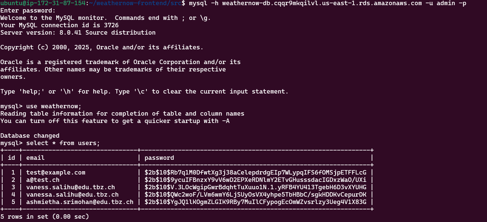

# Dokumentation

### EC2 Instanz in AWS
Als erstes habe ich meine EC2 Instanz erstellt im AWS

1.	EC2 Instanz erstellen
Ubuntu 22.04 LTS
Ports 22 (SSH) und 80 (HTTP) in der Security Group geöffnet


2. Dann habe ich der Instanz eine fixe IP zugewiesen


### SSH 
3. Danach habe ich mich via SSH auf meine Instanz verbunden

<pre> ssh -i ~/.ssh/key-300.pem ubuntu@52.86.197.92 
</pre>


### Nginx , Node.js und npm 
4. Danach habe ich meinen Server vorbereitet und Nginx als Webserver installiert 

<pre>sudo apt update && sudo apt upgrade -y
sudo apt install nginx -y
</pre>

5. Als nächstes habe ich Node.js installiert,mit dem ich den serverseitigen Code in JavaScript ausführen kann. Dies brauche ich später für meine REST-API im Backend und für die Verbindung zu meiner MySQL-Datenbank zur Speicherug meiner Login Daten. 

    Dazu habe ich noch npm installiert. Das ist der Paketmanager von Node.js.
    Ich brauche ihn für folgende Pakete:
  - express (API Server)
  - bcrypt (fürs Passwort Hashing)
  - mysql2 (für die Verbindung zur RDS-Datenbank)

<pre>
curl -fsSL https://deb.nodesource.com/setup_20.x | sudo -E bash -
sudo apt install -y nodejs
</pre>

### RDS Datenbank in AWS
6. Danach habe ich mit dem Dienst Aurora und RDS in AWS eine Datenbank erstellt 


Dabei habe ich direkt einen user ,,admin" mit Passwort und die DB ,,weathernow" erstellt

## Backup 


Ich wollte für meine Datenbank automatische tägliche Backups in AWS aktivieren. 
Dabei habe ich:

- die Aufbewahrung auf 1 Tag gesetzt

- ein Zeitfenster für das Backup gewählt

- das Kopieren von Tags aktiviert

Automatische Backups funktionieren nur mit der InnoDB-Speicher-Engine.
Meine Tabelle ist aber mit MyISAM gemacht, deshalb geht es nicht automatisch.

### Lösungsidee: ###
Ich könnte die Tabelle auf InnoDB umstellen oder ein eigenes Backup mit mysqldump und einem Cronjob machen.

### RDS Datenbank in AWS
Danach habe ich mich folgendermassen von meiner EC2 Instanz aus auf meine DB connectet mit meinem Endpoint der RDS:

<pre> mysql -h weathernow-db.cqqr9mkqilvl.us-east-1.rds.amazonaws.com -u admin -p
</pre>

Dort drin habe ich dann die Tabelle Users erstellt, in der beim Registrieren, die Daten gespeichert werden.

<pre>
CREATE TABLE users (
  id INT AUTO_INCREMENT PRIMARY KEY,
  email VARCHAR(255) NOT NULL,
  password VARCHAR(255) NOT NULL
);
</pre>

Wichtig ist es, den Port 3306 in der entsprechenden Sicherheitsgruppe zu öffnen, damit die EC2 Instanz mit der MySQL Datenbank kommunizieren kann. 


## Wetterdaten API

als API habe ich die openweathermap benutzt: https://home.openweathermap.org/

Dort habe ich ein Benutzerkonto erstellt und anschliessend den API Key generiert und kopiert.


## Backend

Als erstes habe ich einen Ordner erstellt für die index.js Datei

<pre>mkdir ~/weathernow-api
touch index.js
</pre>

Anschliessend habe ich wie oben erwähnt folgende Pakete installiert:

<pre>
npm init -y
npm install express bcrypt mysql2 cors
</pre>


Folgender Inhalt habe ich in die index.js Datei eingefügt


```jsx
const express = require('express');
const bcrypt = require('bcrypt');
const mysql = require('mysql2');
const cors = require('cors'); 

const app = express();
app.use(express.json());


app.use(cors({
  origin: 'http://52.86.197.92', //  
  methods: ['GET', 'POST', 'OPTIONS'],
  credentials: true
}));


const db = mysql.createConnection({
  host: 'weathernow-db.cqqr9mkqilvl.us-east-1.rds.amazonaws.com',
  user: 'admin',
  password: 'xxx',
  database: 'weathernow'
});

// Registrierung
app.post('/register', async (req, res) => {
  const { email, password } = req.body;
  const hashed = await bcrypt.hash(password, 10);
  db.query('INSERT INTO users (email, password) VALUES (?, ?)', [email, hashed], (err) => {
    if (err) return res.status(500).send('Fehler bei Registrierung');
    res.send('Registriert');
  });
});

// Login
app.post('/login', (req, res) => {
  const { email, password } = req.body;
  db.query('SELECT * FROM users WHERE email = ?', [email], async (err, results) => {
    if (err || results.length === 0) return res.status(401).send('Benutzer nicht gefunden');
    const valid = await bcrypt.compare(password, results[0].password);
    if (!valid) return res.status(401).send('Falsches Passwort');
    res.send('Login erfolgreich');
  });
});

app.listen(3000, '0.0.0.0', () => console.log('API läuft auf Port 3000'));


```


Damit das Node.js backend von aussen erreichbar ist, habe ich noch den Port 3000 freigeschaltet


## Frontend
Dann habe ich mit diesem Command unten ein Grundgerüst für das Frontend erstellt

<pre>
npx create-react-app weathernow-frontend
cd weathernow-frontend
</pre>

Insgesamt habe ich folgende Dateien bearbeitet:

./src/App.js

Diese Datei habe ich bearbeitet, damit meine Website mehrere Seiten bzw. Routen anzeigen kann. 

Wenn man im Browser also die IP und einen / eingibt, wird das File HomePage angezeigt. 

Wenn dies erfolgreich durchgelaufen ist, wird man zu /weather weitergeleitet. 

```jsx
import React from 'react';
import { BrowserRouter as Router, Routes, Route } from 'react-router-dom';
import HomePage from './HomePage';
import WeatherPage from './WeatherPage';

function App() {
  return (
    <Router>
      <Routes>
        <Route path="/" element={<HomePage />} />
        <Route path="/weather" element={<WeatherPage />} />
      </Routes>
    </Router>
  );
}

export default App;
```


./src/HomePage.jsx

Bei der HomePage wird einfach das LoginForm und das RegisterForm angezeigt

```jsx
import React from 'react';
import LoginForm from './LoginForm';
import RegisterForm from './RegisterForm';

export default function HomePage() {
  return (
    <div style={{ display: 'flex', justifyContent: 'center', gap: '50px', padding: '50px' }}>
      <div>
        <h2>Login</h2>
        <LoginForm />
      </div>
      <div>
        <h2>Registrieren</h2>
        <RegisterForm />
      </div>
    </div>
  );
}
```

#### Browseransicht:


./src/LoginForm.jsx

```jsx
import React, { useState } from 'react';
import { useNavigate } from 'react-router-dom';

export default function LoginForm() {
  const [email, setEmail] = useState('');
  const [password, setPassword] = useState('');
  const [message, setMessage] = useState('');
  const navigate = useNavigate();

  const handleLogin = async () => {
    try {
      const res = await fetch('http://52.86.197.92:3000/login', {
        method: 'POST',
        headers: { 'Content-Type': 'application/json' },
        body: JSON.stringify({ email, password })
      });

      const text = await res.text();

      if (res.ok) {
        localStorage.setItem('userEmail', email);
        navigate('/weather'); 
      } else {
        setMessage('❌ ' + text);
      }
    } catch (error) {
      setMessage('❌ Server nicht erreichbar');
    }
  };

  return (
    <div>
      <h2>Login</h2>
      <input
        type="email"
        placeholder="E-Mail"
        value={email}
        onChange={e => setEmail(e.target.value)}
      /><br />
      <input
        type="password"
        placeholder="Passwort"
        value={password}
        onChange={e => setPassword(e.target.value)}
      /><br />
      <button onClick={handleLogin}>Login</button>
      <p>{message}</p>
    </div>
  );
}
```

#### bei nicht erfolgreichem Login:


#### bei erfolgreichem Login:


#### wenn node.js nicht läuft ist Server nicht erreichbar


./src/RegisterForm.jsx


wenn ich nun in meine DB gehe, erscheinen die Registrierungsdaten in der DB

<pre>mysql -h weathernow-db.cqqr9mkqilvl.us-east-1.rds.amazonaws.com -u admin -p
</pre>




./src/WeatherPage.jsx

```jsx
import React, { useEffect, useState } from 'react';

export default function WeatherPage() {
  const [weather, setWeather] = useState(null);
  const [error, setError] = useState('');
  const city = 'Zurich'; // Stadtname oder dynamisch später

  useEffect(() => {
    const apiKey = 'e2b0cc1693fef6547d8c9fe07f91b13d'; //
    const fetchWeather = async () => {
      try {
        const res = await fetch(
          `https://api.openweathermap.org/data/2.5/weather?q=${city}&appid=${apiKey}&units=metric`
        );
        const data = await res.json();
        if (res.ok) {
          setWeather(data);
        } else {
          setError(data.message || 'Fehler beim Abrufen');
        }
      } catch (err) {
        setError('❌ Keine Verbindung zur API');
      }
    };

    fetchWeather();
  }, []);

  return (
    <div>
      <h2>🌤️ Wetter in {city}</h2>
      {error && <p style={{ color: 'red' }}>{error}</p>}
      {weather ? (
        <div>
          <p><b>Temperatur:</b> {weather.main.temp}°C</p>
          <p><b>Wetter:</b> {weather.weather[0].description}</p>
        </div>
      ) : (
        !error && <p>Lade Wetterdaten...</p>
      )}
    </div>
  );
}
```

### Build & Deployment mit Nginx

das ist meine Nginx Konfiguration:

<pre>
sudo nano /etc/nginx/sites-available/default
</pre>
Diese Konfiguration sieht so aus:

```jsx
server {
    listen 80;
    server_name _;

    root /var/www/html;
    index index.html;

    location / {
        try_files $uri /index.html;
    }
}

```

### Monitoring

Da ich keine Berechtigung hatte, IAM Rollen zu erstellen, konnte ich nicht CloudWatch verwenden. 

Stattdessen habe ich PM2 auf der EC2 Instanz installiert. 


PM2:
- Hält die API dauerhaft am laufen
- Startet bei Fehlern neu
- Speichert & zeigt logs an


Zuerst habe ich PM2 installiert 
<pre>
sudo npm install -g pm2
</pre>

Danach die API gestartet

<pre>
cd ~/weathernow-api
pm2 start index.js --name weather-api
</pre>


Hier kann ich dann den Status ansehen

<pre>
pm2 status
</pre>

Da werden mir CPU, Speicherverbrauch und der Zustand der API angezeigt.


Damit kann man nun z.B für die Fehleranalyse bei Login / DB Problemen die Logs anzeigen
<pre>
pm2 logs
</pre>


